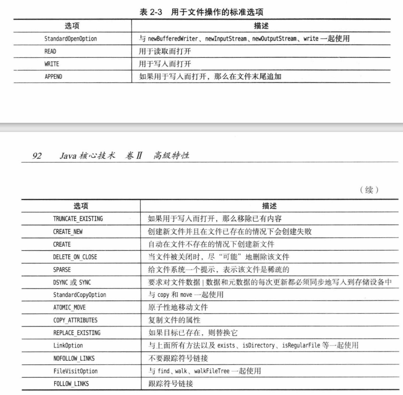

2.4操作文件
你已经学习了如何从文件中读写数据，然而文件管理的内涵远远比读写要广。Path 和Files 类封装了在用户机器上处理文件系统所需的所有功能。例如，Files 类可以用来移除或重命名文件，或者查询文件最后被修改的时间。换句话说，输入/输出流类关心的是文件的内容，而我们在此处要讨论的类关心的是文件在磁盘上的存储。
Path 接口和 Files 类是在 Java 7 中新添加来的，它们用起来比自JDK 10以来就一直用的 File类要方便得多。我们认为这两个类会在 Java 程序员中流行起来，因此在这里做深度讨论。

2.4.1 Path
Path (路径)表示的是一个目录名序列，其后还可以跟着一个文件名。路径中的第一个部件可以是根部件，例如/或 C:，而允许访问的根部件取决于文件系统。以根部件开始的路径是绝对路径;否则，就是相对路径。例如，我们要分别创建一个绝对路径和一个相对路径;其中，对于绝对路径，我们假设计算机运行的是类 UNIX 的文件系统:
Path absolute = Paths,get("/home"，"harry");Path relative = Paths.get("myprog"，"conf"，"user.properties");
静态的 Paths.get 方法接受一个或多个字符串，并将它们用默认文件系统的路径分隔符(类UNIX 文件系统是，Windows 是) 连接起来。然后它解析连接起来的结果，如果其表示的不是给定文件系统中的合法路径，那么就抛出InvalidPathException 异常。这个连接起来的结果就是一个 Path 对象。
get 方法可以获取包含多个部件的单个字符串，例如，可以像下面这样从配置文件中读取路径:
String baseDir =props.getProperty("base.dir");
// May be a string such as /opt/myprog or c:\Program Files\myprogPath basePath = Pathsget(baseDir); // 0K that baseDir has separators

注释:路径不必对应着某个实际存在的文件，它仅仅是一个抽象的名字序列。在接下来的小节中将会看到，当你想要创建文件时，首先要创建一个路径，然后才调用方法去创建对应的文件。
组合或解析路径是司空见惯的操作，调用 p.resolve(q) 将按照下列规则返回一个路径:。如果q是绝对路径，则结果就是 q。
。否则，根据文件系统的规则，将“p后面跟着 g”作为结果。例如，假设你的应用系统需要查找相对于给定基目录的工作目录，其中基目录是从配置文件中读取的，就像前一个例子一样。
Path workRelative = Paths.get("work");Path workPath = basePath.resolve(workRelative);
resolve 方法有一种快捷方式，它接受一个字符串而不是路径:Path workPath = basePath,resolve("work");
还有一个很方便的方法 resolvesibling，它通过解析指定路径的父路径产生其兄弟路径例如，如果 workPath 是 /opt/myapp/work，那么下面的调用
Path tempPath = workPath.resolveSibling("temp");将创建/opt/myapp/temp

还有一个很方便的方法 resolvesibling，它通过解析指定路径的父路径产生其兄弟路径。例如，如果 workPath 是 /opt/myapp/work，那么下面的调用Path tempPath = workPath.resolveSibling("temp");
将创建/opt/myapp/temp。resolve 的对立面是 relativize，即调用 p.relativize(r)将产生路径g，而对q 进行解析的结果正是r。例如，以“/home/harry”为目标对“/home/fred/input.txt”进行相对化操作，会产生../fred/input.txt”，其中，我们假设..表示文件系统中的父目录。normalize 方法将移除所有冗余的，和部件(或者文件系统认为余的所有部件)。例如规范化/home/harry/../fred/./input.txt将产生/home/fred/input.txt。
toAbsolutePath 方法将产生给定路径的绝对路径，该绝对路径从根部件开始，例如 /homefred/input.txt 或c:\Users\fred\input.txt
Path 类有许多有用的方法用来将路径断开。下面的代码示例展示了其中部分最有用的方法:
Path p= Paths.get("/home"，"fred"，"myprog.properties");
Path parent = p.getParent(); // the path /home/fredPath file = p.getFileName(); // the path myprog.propertiesPath root = p.getRoot(); // the path /
正如你已经在卷I中看到的，还可以从Path 对象中构建Scanner 对象:
var in = new Scanner(Paths.get("/home/fred/input.txt"));
注释:偶尔，你可能需要与遗留系统的 API交互，它们使用的是File类而不是Path接口。Path接口有一个toFile方法，而File类有一个toPath 方法。

Files 类可以使得普通文件操作变得快捷。例如，可以用下面的方式很容易地读取文件的所有内容:
byte[] bytes = Files.readAllBytes(path);
正如在 2.1.6 节中介绍过的，我们可以如下从文本文件中读取内容:var content = Files.readString (path ， charset);
但是如果希望将文件当作行序列读入，那么可以调用:List<String> lines = Files.readAllLines(path，charset);
相反，如果希望写出一个字符串到文件中，可以调用:
Files.writeString(path，content.charset);
向指定文件追加内容，可以调用:
Files.write(path，content.getBytes(charset)，StandardOpen0ption.APPEND);
还可以用下面的语句将一个行的集合写出到文件中:
Files.write(path，lines, charset);
这些简便方法适用于处理中等长度的文本文件，如果要处理的文件长度比较大，或者是二进制文件，那么还是应该使用所熟知的输入/输出流或者读入器/写出器
InputStream in =FilesnewInputStream(path);OutputStream out = Files.newOutputStream(path);Reader in = Files.newBufferedReader(path，charset);Writer out = FilesnewBufferedwriter(path， charset);
这些便捷方法可以将你从处理 FileInputStream、File0utputStream、BufferedReader 和 Buffered-Writer 的繁复操作中解脱出来。

2.4.3创建文件和目录
创建新目录可以调用
Files.createDirectory(path);
其中，路径中除最后一个部件外，其他部分都必须是已存在的。要创建路径中的中间目录应该使用
Files.createDirectories(path);
可以使用下面的语句创建一个空文件:
Files.createFile(path);
如果文件已经存在了，那么这个调用就会抛出异常。检查文件是否存在和创建文件是原子性的如果文件不存在，该文件就会被创建，并且其他程序在此过程中是无法执行文件创建操作的。有些便捷方法可以用来在给定位置或者系统指定位置创建临时文件或临时目录:
Path newPath = Files,createTempFile(dir，prefix，suffix);
Path newPath = Files,createTempFile(prefix，suffix);
Path newPath = Files.createTempDirectorv(dir，prefix):
Path newPath = Files.createTempDirectory(prefix);其中，dir 是一个 Path 对象，prefix和 suffix 是可以为 null 的字符串。例如，调用 Files.createTempFile(null,",txt")可能会返回一个像/tmp/1234405522364837194,txt 这样的路径。在创建文件或目录时，可以指定属性，例如文件的拥有者和权限。但是，指定属性的细节取决于文件系统，本书在此不做讨论。

2.4.4复制、移动和删除文件
将文件从一个位置复制到另一个位置可以直接调用Files.copy(fromPath，toPath);
移动文件 (即复制并删除原文件) 可以调用
Files.move(fromPath，toPath):
如果目标路径已经存在，那么复制或移动将失败。如果想要覆盖已有的目标路径，可以使用 REPLACE EXISTING 选项。如果想要复制所有的文件属性，可以使用COPY ATTRIBUTES 选项也可以像下面这样同时选择这两个选项:
Files.copy(fromPath，toPath，StandardCopy0ption.REPLACE EXISTING,StandardCopyOption.COPY ATTRIBUTES);
你可以将移动操作定义为原子性的，这样就可以保证要么移动操作成功完成，要么源文件继续保持在原来位置。具体可以使用ATOMIC MOVE选项来实现Files,move(fromPath，toPath，StandardCopy0ption.ATOMIC MOVE);
你还可以将一个输人流复制到 Path 中，这表示想要将该输入流存储到硬盘上。类似地你可以将一个 Path 复制到输出流中。可以使用下面的调用:
Files.copy(inputStream，toPath);Files.copy(fromPath，outputStream);
至于其他对 copy 的调用，可以根据需要提供相应的复制选项最后，删除文件可以调用:
Files.delete(path):
如果要删除的文件不存在，这个方法就会抛出异常。因此，可转而使用下面的方法:boolean deleted = FilesdeletelfExists(path);
该删除方法还可以用来移除空目录

