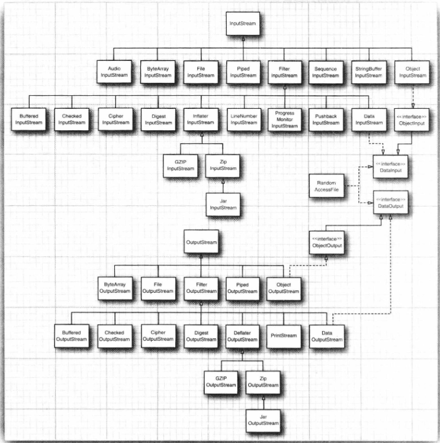
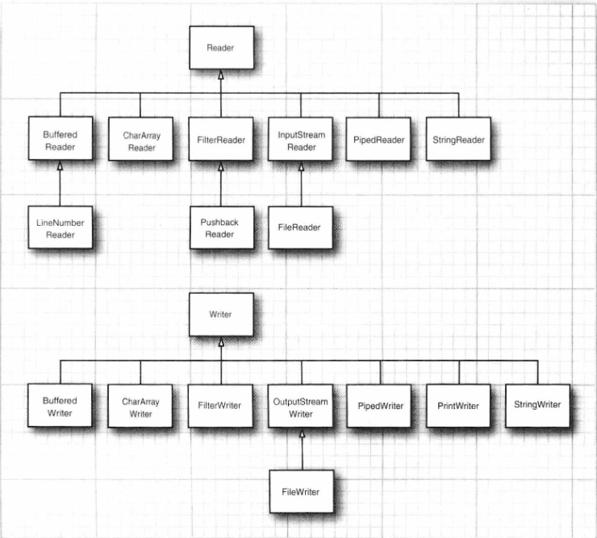
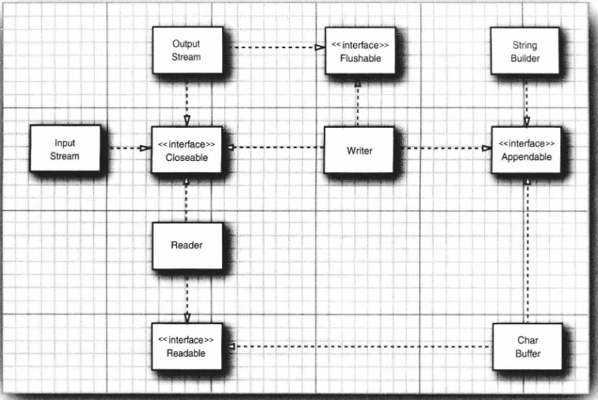

本章将介绍Java中用于输入和输出的各种应用编程接口(Application ProgrammingInterface，API)。你将要学习如何**访问文件与目录**，以及如何**以二进制格式和文本格式来读写数据**。本章还要向你展示**对象序列化机制**，它可以使存储对象像存储文本和数值数据一样容易。然后，我们将介绍如何使用文件和目录。最后，本章将**讨论正则表达式**，尽管这部分内容实际上与输入和输出并不相关，但是我们确实也找不到更合适的地方来处理这个话题很明显，Java 设计团队在这个问题的处理上和我们一样，因为正则表达式API的规格说明隶属于"新I/O"特性的规格说明

## 输入输出流
在 Java API 中，**可以从其中读入一个字节序列的对象称作输入流，而可以向其中写入一个字节序列的对象称作输出流**。这此字节序列的来源地和目的地可以是文件，而且通常都是文件，但是也可以是网络连接，甚至是内存块。**抽象类** `InputStream` 和 `OutputStream` 构成了输入/输出(I/O)类层次结构的基础

### 1. 读写字节
`Inputstream` 类有一个抽象方法: **`abstract int read()`**, 这个方法将读人一个字节，并返回读入的字节，或者在遇到输入源结尾时返回 -1. 在设计具体的输入流类时，必须覆盖这个方法以提供适用的功能.

例如，在 `FileInputStream` 类中, 这个方法将从某个文件中读入一个字节，而 System.in (它是InputStream 的一个子类的预定义对象)却是从标准输入中读入信息，即从控制台或重定向的文件中读入信息。InputStream 类还有若干个非抽象的方法，它们可以读入一个字节数组，或者跳过大量的字节。从 Java 9 开始，有了一个非常有用的可以读取流中所有字节的方法: `byte[] bytes = in,readAllBytes();` 还有多个用来读取给定数量字节的方法，可以参见 API说明. 这些方法都要调用抽象的 read 方法，因此，各个子类都只需覆盖`read()`这一个方法

与此类似，Outputstream类定义了下面的抽象方法: **`abstract void write(int b)`** 它可以向某个输出位置写出一个字节。如果我们有一个字节数组，那么就可以一次性地写出它们:
```java
byte[] values = ...;
out.write(values);
```
`transferTo`方法可以将所有字节从一个输入流传递到一个输出流: `in.transferTo(out);`

**read 和 write 方法在执行时都将阻塞**，直至字节确实被读入或写出。这就意味着**如果流不能被立即访问(通常是因为网络连接忙)，那么当前的线程将被阳塞。这使得在这两个方法等待指定的流变为可用的这段时间里，其他的线程就有机会去执行有用的工作**。
`available` 方法使我们可以去检查当前可读入的字节数量，这意味着像下面这样的代码片段不可能被阻塞:
```java
int bytesAvailable = in.available();
if (bytesAvailable >0)
    var data = new byte[bytesAvailable];
    in.read(data);
```

**当你完成对输入/输出流的读写时，应该通过调用close 方法来关闭它，这个调用会释放掉十分有限的操作系统资源**。如果一个应用程序打开了过多的输入/输出流而没有关闭，那么系统资源将被耗尽。关闭一个输出流的同时还会冲刷用于该输出流的缓冲区:所有被临时置于缓冲区中，以便用更大的包的形式传递的字节在关闭输出流时都将被送出。特别是，如果不关闭文件，那么写出字节的最后一个包可能永远也得不到传递。当然，我们还可以用flush 方法来人为地冲刷这些输出。

即使某个输入/输出流类提供了使用原生的 read 和 write 功能的某些具体方法，应用系统的程序员还是很少使用它们，因为大家感兴趣的数据可能包含数字、字符串和对象，而不是原生字节。
我们可以**使用众多的构建于基本的 InputStream 和 OutputStream 类之上的某个输入/输出类，而不只是直接使用字节**。

与C语言只有单一类型 FILE* 包打天下不同，**Java 拥有一个流家族，包含各种输入/输出流类型，其数量超过 60 个**请参见图 2-1 和图 2-2。

图2-1 输入输出流的层次结构

图2-2 Reader 和 Writer 的层次结构

让我们把输入/输出流家族中的成员按照它们的使用方法来进行划分，这样就形成了处理字节和字符的两个单独的层次结构。正如所见，InputStream 和 OutputStream 类可以读写单个字节或字节数组，这些类构成了图 2-1 所示的层次结构的基础。要想读写字符串和数字，就需要功能更强大的子类，例如，**DataInputStream 和 DataOutputStream 可以以二进制格式读写所有的基本Java类型**。最后，还包含了多个很有用的输入/输出流，例如，ZipInputStream 和 ZipOutputStream 可以以我们常见的ZIP压缩格式读写文件。

还有4个附加的接口: `Closeable`, `Flushable`, `Readable` 和 `Appendable` (请查看图2-3)。前两个接口非常简单，它们分别拥有下面的方法:
`void close() throws IOException`
`void flush()`

InputStream, OutputStream, Reader, Writer 都实现了 Closeable 接口, OutputStream 和 Writer 还实现了 Flushable 接口

Readable 接口只有一个方法:
`int read(CharBuffer cb)`
CharBuffer 类拥有按顺序和随机地进行读写访问的方法，它表示一个内存中的缓冲区或者一个内存映像的文件(请参见 2.5.2 节以了解细节)。

Appendable 接口有两个用于添加单个字符和字符序列的方法:
`Appendable append(char c)`
`Appendable append(CharSequence s)`
CharSequence 接口描述了一个 char 值序列的基本属性，String、CharBuffer、StringBuilder 和StringBuffer都实现了它。

在流类的家族中，只有 Writer 实现了 Appendable。

### 2. 磁盘文件IO流
`FileInputStream` 和 `FileoutputStream` 可以提供附着在一个磁盘文件上的输入流和输出流，而你只需向其构造器提供文件名或文件的完整路径名。例如: `var fin = new FileInputStream("employee.dat");`
这行代码可以查看用户目录下名为“employee.dat”的文件。

提示: 所有在 java.io中的类都将相对路径名解释为**以用户工作目录开始**，你可以通过调用**System.getProperty("user.dir")**来获得这个信息。

警告:由于反斜杠字符在Java 字符串中是转义字符，因此要确保在 Windows 风格的路径名中使用`\\`(例如，`C:\\Windows\\win.ini`)。在Windows中，还可以使用单斜杠字符(`C:Windows/win.ini`)，因为大部分Windows 文件处理的系统调用都会将斜杠解释成文件分隔符。但是，并不推荐这样做，因为 Windows 系统函数的行为会因与时俱进而发生变化。因此，对于可移植的程序来说，应该使用程序所运行平台的文件分隔符,我们可以通过常量字符串`java.io.Fileseparator`获得它。

与抽象类 InputStream 和 OutputStream 一样，这此类只支持在字节级别上的读写。也就是说.我们只能从 fin 对象中读入字节和字节数组
`byte b = (byte) fin.read();`
正如下节中看到的，如果我们只有 `DataInputstream`, 那么我们就只能读入数值类型:
```java
DataInputStream din = ...;
double x = din.readDouble();
```
但是正如 `FileInputStream` 没有任何读入数值类型的方法一样， `DataInputStream` 也没有任何从文件中获取数据的方法。Java 程序员必须对二者进行组合。例如，为了从文件中读入数字，首先需要创建一个 FileInputStream, 然后将其传递给 DataInputStream 的构造器:
```java
var fin = new FileInputStream("employee.dat");
var din = new DataInputStream(fin);
double x = din.readDouble();
```
如果再次查看图 2-1，你就会看到 FilterInputStream和 FilterOutputStream类。这些文件的子类用于向处理字节的输入/输出流添加额外的功能你可以通过嵌套过滤器来添加多重功能。例如，输流在默认情况下是不被缓冲区缓存的，也就是说，每个对 read 的调用都会请求操作系统再分发一个字节。相比之下，请求一个数据块并将其置于缓冲区中会显得更加高效。如果我们**想使用缓冲机制和用于文件的数据输入方法，那么就需要使用下面这种相当复杂的构造器序列**:
```java
var din = new DataInputStream(
    new BufferedInputStream(
        new FileInputStream("employee.dat")
    ));
```
注意，我们把 DataInputStream 置于构造器链的最后，这是因为我们希望使用 DataInputStream 的方法，并且希望它们能够使用带缓冲机制的 read 方法。

有时当多个输入流链接在一起时，你需要**跟踪各个中介输入流** (intermediate input stream)例如，当读入输入时，你经常需要预览下一个字节，以了解它是否是你想要的值。Java 提供了用于此目的的 `PushbackInputStream`:
```java
var pbin = new PushbackInputStream(
    new BufferedInputStream(
        new FileInputStream("employee.dat")
    ));
```
现在你可以预读下一个字节:
`int b = pbin.read();`
并且在它并非你所期望的值时将其推回流中。
`if(b!='<') pbin.unread(b);`
但是读入和推回是可应用于可回推 (pushback) 输入流的仅有的方法。如果你希望能够预先浏览并且还可以读入数字，那么就需要一个既是可回推输入流，又是一个数据输入流的引用。
`var din = new DataInputStream(pbin);`
当然，在其他编程语言的输入/输出流类库中，诸如缓冲机制和预览等细节都是自动处理的。因此，相比较而言，Java 就有一点麻烦，它必须将多个流过滤器组合起来。但是，这种混合并匹配过滤器类以构建真正有用的输入/输出流序列的能力，将带来极大的灵活性，例如，你可以从一个 ZIP 压缩文件中通过使用下面的输入流序列来读入数字(请参见图 2-4):
```java
var zin = new ZipInputStream(new FileInputStream("employee.zip"));
var din = new DataInputStream(zin);
```

### 3. 文本字符串读写
**`OutputStreamwriter`** 类将使用选定的字符编码方式, 把 Unicode 码元的输出流转换为字节流。而 **`InputStreamReader`** 类将包含字节(用某种字符编码方式表示的字符)的输入流转换为可以产生 Unicode 码元的读入器。
例如，下面的代码就展示了如何让输入读入器从控制台读入键盘敲击信息，并将其转换为 Unicode:
`var in = new InputStreamReader(System.in);`
这个输入流读入器会假定使用主机系统所使用的默认字符编码方式。在桌面操作系统中，它可能是像Windows 1252或 MacRoman 这样古老的字符编码方式。你应该总是在InputstreamReader 的构造器中选择一种具体的编码方式。例如
`var in = new InputStreamReader(new FileInputStream("data.txt"), StandardCharsets.UTF_8);`
Reader 和 Writer 类都只有读入和写出单个字符的基础方法。在使用流时，可以使用处理字符串和数字的子类。

#### 3.1 如何写出文本输出
对于文本输出，可以使用 **`Printwriter`**, 这个类拥有**以文本格式打印字符串和数字的方法**。为了打印文件，需要用文件名和字符编码方式构建一个 PrintStream 对象:
`var out = new PrintWriter("employee.txt"，StandardCharsets.UTF 8);`
为了输出到打印写出器，需要使用**与使用 System.out 时相同的 print、println 和 printf方法, 可以用此方法来打印数字 (int、short、long、float、double)、字符、boolean值、字符串和对象**。
例如，考虑下面的代码:
```java
String name ="Harry Hacker";
double salary = 75000;
outprint(name);
out.print(' ');
out.println(salary);
```
它将把字符`Harry Hacker 750000`输出到写出器out，之后这些字符将会被转换成字节并最终写入 employee.txt 中. println 方法在行中添加了对目标系统来说恰当的行结束符(Windows系统是"r\n", UNIX 系统是"n", 可通过调用 `System.getProperty("ine.separator")`获得).
如果写出器设置为自动冲刷模式，那么只要 println 被调用，缓冲区中的所有字符都会被发送到它们的目的地(打印写出器总是带缓冲区的)。默认情况下，自动冲刷机制是禁用的.

#### 3.2 读入文本
最简单的处理任意文本的方式就是使用在卷I中我们广泛使用的 **`Scanner`** 类。我们可以从任何输入流中构建 Scanner 对象。
如果文件太大，那么可以将行惰性处理为一个 `Stream<String>` 对象:
```java
try (Stream<String> lines = Files.lines(path,charset))
```
还可以使用扫描器来读入符号 (token)，即由分隔符分隔的字符串，默认的分隔符是空白字符。可以将分隔符修改为任意的正则表达式。例如，下面的代码
```java
Scanner in = ...;
in.useDelimiter("\\PL+");
```
将接受任何非 Unicode 字母作为分隔符。之后，这个扫描器将只接受Unicode 字母。调用 next 方法可以产生下一个符号:
```java
while (in.hasNext())
    String word = in.next();
```
或者，可以像下面这样获取一个包含所有符号的流: `Stream<String> words = in.tokens();`

#### 3.3 以文本的方式读写 Employee 数组
在本节，我们将带你领略一个示例程序，它将一个 Employee 记录数组存储成了一个文本文件，其中每条记录都保存成单独的一行，而实例字段彼此之间使用分隔符分离开，这里我们使用竖线(|)作为分隔符(冒号(:)是另一种流行的选择，有趣的是，每个人都会使用不同的分隔符)。因此，我们这里是在假设不会发生在要存储的字符串中存在|的情况。
下面是一个记录集的样本:
```txt
Harry Hacker|3550.0|1989-10-01
Carl Cracker|7500.0|1987-12-15
Tony Testerl|3800.0|1990-03-15
```
写出记录相当简单，因为是要写出到一个文本文件中，所以我们使用 `Printwriter` 类。我们直接写出所有的字段，每个字段后面跟着一个|，而最后一个字段的后面跟着一个换行符。
`split` 方法的参数是一个描述分隔符的正则表达式, 碰巧的是, 竖线`|`在正则表达式中具有特殊的含义, 因此需要用`\`字符来表示转义, 而这个`\`又需要用另一个`\`来转义, 这样就产生了"\\|"表达式。

**`Employee.java`**
```java
public class Employee {
    String name;
    Double salary;
    LocalDate entryDate;

    public Employee(String name, Double salary, int year, int month, int day) {
        this.name = name;
        this.salary = salary;
        this.entryDate = LocalDate.of(year, month, day);
    }

    public int getYear(){
        return entryDate.getYear();
    }

    public int getMonth(){
        return entryDate.getMonthValue();
    }

    public int getDay(){
        return entryDate.getDayOfMonth();
    }

    public String getName() {
        return name;
    }

    public Double getSalary() {
        return salary;
    }
    // Convert Employee to a format String
    @Override
    public String toString() {
        return name + "|" + salary + "|" + getYear() + "|" + getMonth() + "|" + getDay();
    }
    // Convert a format String to Employee
    public Employee(String formatEmpStr){
        String[] attrList = formatEmpStr.split("\\|");
        name = attrList[0];
        salary = Double.parseDouble(attrList[1]);
        int year = Integer.parseInt(attrList[2]);
        int month = Integer.parseInt(attrList[3]);
        int day = Integer.parseInt(attrList[4]);
        entryDate = LocalDate.of(year, month, day);
    }
}
```
该实体类包含三个字段, 其中日期字段用 LocalDate 表示, 但构造时是提供的年月日三个整数, 此外还有一系列的getter. 这里重写了 toString 方法, 它将 Employee 对象转为字符串, 其格式正如要求中所述. 另外还实现了一个从字符串构造 Employee 对象的方法, 该字符串必须是 toString 中得到的那样的规整字符串. 这两个方法就使得写入 Employee[] 到文件, 以及从文件读入到 Employee[] 变得很方便.

考虑 Employee[] 写入到输出流, 也就是把字符串写到输出流, 则可以借助于 PrintWriter 类, 同时写入数组长度, 方便读取, 如下:
```java
public static void writeEmpArr(Employee[] employees, PrintWriter out){
    out.println(employees.length);
    for(Employee employee: employees)
        out.println(employee.toString());
    out.close();
}
```
因此, 读出代码相应的如下, 这里使用了 Scanner 类, 同时注意到为了保持读出的一致性, 即使是读出一个整数也是按行读出(`in.nextLine()`)然后转为整数:
```java
public static Employee[] readEmpArr(Scanner in){
    int n = Integer.parseInt(in.nextLine());
    Employee[] staff = new Employee[n];
    for(int i=0; i<n; i++){
        String line = in.nextLine();
        staff[i] = new Employee(line);
    }
    in.close();
    return staff;
}
```
可以看到, 重写 toString 以及新增的构造方法使得写入读出方法变得无比简洁自然.
那么接下来就是初始化一个 Employee[] 然后进行测试:
```java
public static Employee[] getStaff(){
    Employee[] staff = new Employee[5];
    staff[0] = new Employee("Carl Cracker", 75000.0, 1987, 12, 15);
    staff[1] = new Employee("Harry Hacker", 50000.0, 1989, 10, 1);
    staff[2] = new Employee("Tony Tester", 40000.0, 1990, 3, 15);
    staff[3] = new Employee("Julie Matter", 85000.0, 1992, 2, 29);
    staff[4] = new Employee("Hemmer Crusher", 72000.0, 1985, 10, 23);
    return staff;
}

public static void main(String[] args) throws IOException{
    // 1. 将 Employee[] 写到文件: "txt/employee.txt"
    writeEmpArr(getStaff(), new PrintWriter(new FileOutputStream("txt/employee.txt")));
    //    另一种初始化 PrintWriter 的方法
    //    writeEmpArr(getStaff(), new PrintWriter("txt/employee.txt", StandardCharsets.UTF_8));
    // 2. 从文件/标准输入读到 Employee[]
    Employee[] staff = readEmpArr(new Scanner(new FileInputStream("txt/employee.txt")));
    //     将 Employee[] 写到标准输出: 也即打印对象的内容到屏幕上
    writeEmpArr(staff, new PrintWriter(System.out));
}
```

### 4. 读写二进制数据
文本格式对于测试和调试而言会显得很方便，因为它是人类可阅读的，但是它并不像以二进制格式传递数据那样高效。在下面的各小节中，你将会学习如何用二进制数据来完成输入和输出。
`DataInput` 和 `DataOutput` 接口
`Dataoutput` 接口定义了下面用于以二进制格式写数组、字符、boolean 值和字符串的方法:
```
writeChars, writeByte, writeInt
writeShort, writeLong, writeFloat
writeDouble, writeChar, writeBoolean
writeUTF
```
例如，**`writeInt` 总是将一个整数写出为4字节的二进制数量值，而不管它有多少位，`writeDouble` 总是将一个 double 值写出为8字节的二进制数量值。这样产生的结果并非人可阅读的但是对于给定类型的每个值，使用的空间都是相同的，而且将其读回也比解析文本要更快。**

为了读回数据，可以使用在 `DataInput` 接口中定义的下列方法:
```
readInt, readShort, readLong
readFloat, readDouble, readChar
readBoolean, readUTF
```
**`DataInputStream`** 类实现了 DataInput 接口，为了从文件中读入二进制数据，可以将 DataInputStream 与某个字节源相组合，例如 FileInputStream:
`var in = new DataInputStream(new FileInputStream("employee.dat"));`
与此类似，要想写出二进制数据，你可以使用实现了 Dataoutput 接口的 DataoutputStream类:
`var out = new Data0utputStream(new FileOutputStream("employee.dat"));`

以下为一个读写 Employee[] 的样例, 值得注意的是: 这里没有换行符作为结束标志, 因此可以选择存储每个 Employee 字符串的长度, 同时读出函数也需要自己编写(因为没有readChars方法), 这里是采用了 readChar + StringBuilder 结合的方式
```java
// write an employee[] to DataOutputStream
public static void writeEmpBin(Employee[] employees, DataOutputStream out) throws IOException {
    int n = employees.length;
    out.writeInt(n);
    for (Employee employee : employees) {
        String empStr = employee.toString();
        out.writeInt(empStr.length());  // 这里还写入了每一个 empStr 的长度
        out.writeChars(empStr);
    }
    out.close();
}

// read an employee[] from DataInputStream
public static Employee[] readEmpBin(DataInputStream in) throws IOException {
    int n = in.readInt();
    Employee[] staff = new Employee[n];
    // 没有类似 readChars 的方法, 只能读取单字符或者字节数组
    // writeChars 调用了 writeChar 方法, 每个字符按两个字节存放, 因此
    // 如果操作字节数组可能会比较麻烦, 这里采用 StringBuilder.append 方法, 构造出字符串
    for(int i=0; i<n; i++){
        StringBuilder empStr = new StringBuilder();
        int empStrLen = in.readInt();
        for(int j=0; j<empStrLen; j++)
            empStr.append(in.readChar());
        staff[i] = new Employee(empStr.toString());
    }
    in.close();
    return staff;
}
```
这里同样进行了测试, 同时这里还使用到了已有的 `getStaff` 和 `writeEmpArr`
```java
public static void main(String[] args) throws IOException {
    // 1. 先测试写入 bin file
    String binFile = "txt/employee";
    Employee[] staff = getStaff();
    writeEmpBin(staff, new DataOutputStream(new FileOutputStream(binFile)));
    // 2. 再测试读出 Employee[]
    Employee[] staff2 = readEmpBin(new DataInputStream(new FileInputStream(binFile)));
    // 3. 打印 staff2, 不妨使用已编写的 writeEmpArr 方法
    writeEmpArr(staff2, new PrintWriter(System.out));
}
```

### 5. 随机文件访问
`RandomAccessFile` 类可以在文件中的任何位置查找或写入数据。磁盘文件都是随机访问的,但是与网络套接字通信的输入/输出流却不是。你可以打开一个随机访问文件，只用于读入或者同时用于读写，你可以通过使用字符串"r"(用于读入访问)或"rw"(用于读入/写出访问)作为构造器的第二个参数来指定这个选项:
```java
var in = new RandomAccessFile("employee.dat"，"r");
var inOut = new RandomAccessFile("employeedat”，“rw");
```
当你将已有文件作为 `RandomAccessFile` 打开时，这个文件并不会被删除随机访问文件有一个表示下一个将被读入或写出的字节所处位置的文件指针，seek方法可以用来将这个文件指针设置到文件中的任意字节位置，seek 的参数是一个 long类型的整数，它的值位于 0到文件按照字节来度量的长度之间。getFilePointer 方法将返回文件指针的当前位置。

`RandomAccessFile` 类同时实现了 DataInput 和 DataOutput 接口。为了读写随机访问文件, **可以使用在前面小节中讨论过的诸如 readInt/writeInt 和readChar/writeChar 之类的方法**. 我们现在要剖析一个**将雇员记录存储到随机访问文件中**的示例程序，其中**每条记录都拥有相同的大小**, 这样我们可以很容易地读入任何记录。假设你希望将文件指针置于第三条记录处, 那么你只需将文件指针置于恰当的字节位置，然后就可以开始读入了
```java
long n =3;
in.seek((n-1)* RECORD SIZE);
var e = new Employee();
e.readData(in);
```
如果你希望修改记录，然后将其存回到相同的位置，那么请切记要**将文件指针置回到这条记录的开始处**:
```java
in.seek((n -1)*RECORD SIZE);
e.writeData(out);
```
要确定文件中的字节总数, 可以使用 length 方法, 而记录的总数则等于用字节总数除以每条记录的大小。
```java
long nbytes = in.length(); // length in bytes
int nrecords =(int) (nbytes / RECORD_SIZE);
```

## 附录


