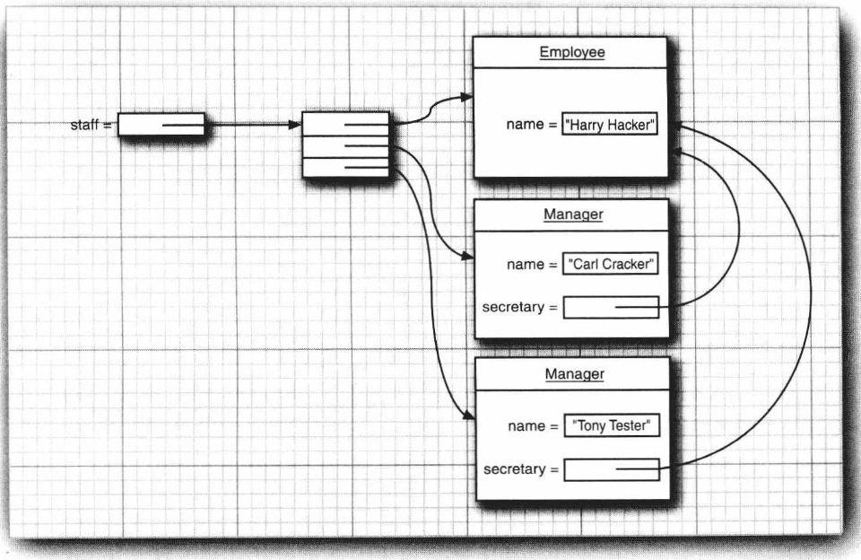
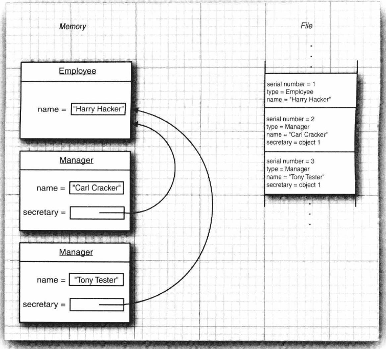
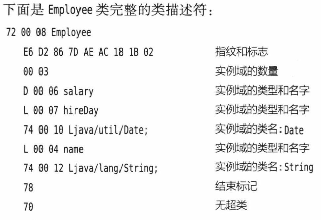
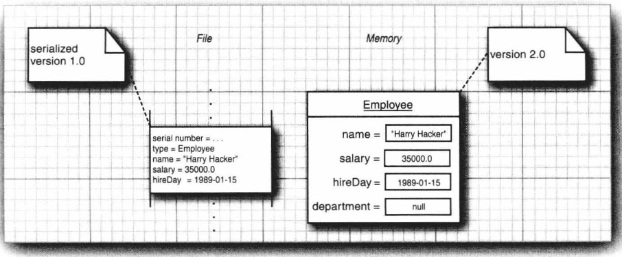
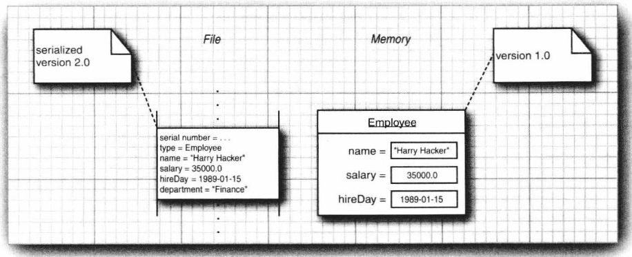

当你需要存储相同类型的数据时，使用固定长度的记录格式是一个不错的选择。但是在面向对象程序中创建的对象很少全部都具有相同的类型。例如，你可能有一个称为 staff 的数组，它名义上是一个Employee 记录数组，但是实际上却包含诸如 Manager 这样的子类实例。我们当然可以自己设计出一种数据格式来存储这种多态集合，但是幸运的是，我们并不需要这么做。Java语言支持一种称为对象序列化 (object serialization)的非常通用的机制，它可以将任何对象写出到输出流中，并在之后将其读回。(你将在本章稍后看到“序列化”这个术语的出处。

2.3.1保存和加载序列化对象
为了保存对象数据，首先需要打开一个objectoutputstream对象
var out = new ObjectOutputStream(new File0utputStream("employee.dat"));现在，为了保存对象，可以直接使用 objectoutputstream 的writeobject 方法，如下所示var harry = new Employee("Harry Hacker"，50000，1989，10，1);var boss= new Manager("Carl Cracker"，80000，1987，12，15);
out.write0bject(harry);out.write0bject(boss);
为了将这些对象读回，首先需要获得一个objectInputstream对象var in = new ObjectInputStream(new FileInputStream("employee.dat"));然后，用 readobject 方法以这些对象被写出时的顺序获得它们:
var el=(Employee) in.readObject();var e2=(Employee) in.readObject();
但是，对希望在对象输出流中存储或从对象输入流中恢复的所有类都应进行一下修改，这些类必须实现Serializable 接口:
class Employee implements Serializable [ ...
Serializable 接口没有任何方法，因此你不需要对这些类做任何改动。在这一点上，它与在卷I第6章中讨论过的Cloneable 接口很相似。但是，为了使类可克隆，你仍旧需要覆盖object 类中的clone 方法，而为了使类可序列化，你不需要做任何事。
注释:你只有在写出对象时才能用writeobject/readobject 方法，对于基本类型值，你需要使用诸如writeInt/readInt或writeDouble/readDouble这样的方法。(对象流类都实现了DataInput/Data0utput 接口。
在幕后，是objectoutputstream 在浏览对象的所有域，并存储它们的内容。例如，当写出Employee对象时，其名字、日期和薪水城都会被写出到输出流中。但是，有一种重要的情况需要考虑:当一个对象被多个对象共享，作为它们各自状态的
部分时，会发生什么呢?
为了说明这个问题，我们对 Manager 类稍微做些修改，假设每个经理都有一个秘书:
class Manager extends Employee
private Employee secretary;
现在每个Manager 对象都包含一个表示秘书的Employee 对象的引用，当然，两个经理可以共用一个秘书，正如图2-5和下面的代码所示的那样:
var harry = new Employee("Harry Hacker"，，..);var carl = new Manager("Carl Cracker"，...);
carl.setSecretary(harry);var tony = new Manager("Tony Tester"，...);
tony.setSecretary(harry);

保存这样的对象网络是一种挑战，在这里我们当然不能去保存和恢复秘书对象的内存地址，因为当对象被重新加载时，它可能占据的是与原来完全不同的内存地址。
与此不同的是，每个对象都是用一个序列号(serial number)保存的，这就是这种机制之所以称为对象序列化的原因。下面是其算法:
。对你遇到的每一个对象引用都关联一个序列号(如图2-6所示)
。对于每个对象，当第一次遇到时，保存其对象数据到输出流中。
如果某个对象之前已经被保存过，那么只写出“与之前保存过的序列号为x的对象相同”

在读回对象时，整个过程是反过来的。
。对于对象输入流中的对象，在第一次遇到其序列号时，构建它，并使用流中数据来初始化它，然后记录这个顺序号和新对象之间的关联。当遇到“与之前保存过的序列号为x的对象相同”这一标记时，获取与这个序列号相关联的对象引用。
注释:在本章中，我们使用序列化将对象集合保存到磁盘文件中，并按照它们被存储的样子获取它们。序列化的另一种非常重要的应用是通过网络将对象集合传送到另一台计算机上。正如在文件中保存原生的内存地址毫无意义一样，这些地址对于在不同的处理器之间的通信也是毫无意义的。因为序列化用序列号代替了内存地址，所以它允许将对象集合从一台机器传送到另一台机器。
程序清单2-3是保存和重新加载Employee和Manager对象网络的代码(有些对象共享相同的表示秘书的雇员)。注意，秘书对象在重新加载之后是唯一的，当 newStaff[1] 被恢复时，它会反映到经理们的secretary城中。

2.32理解对象序列化的文件格式
对象序列化是以特殊的文件格式存储对象数据的，当然，我们不必了解文件中表示对象的确切字节序列，就可以使用 writeobject/readobject 方法。但是，我们发现研究这种数据格式对于洞察对象流化的处理过程非常有益。因为其细节显得有些专业，所以如果你对其实现不感兴趣，则可以跳过这一节。
每个文件都是以下面这两个字节的“魔幻数字”开始的
ACED
后面紧跟着对象序列化格式的版本号，目前是
0005
(我们在本节中统一使用十六进制数字来表示字节。然后是它包含的对象序列，其顺序即它们存储的顺序。
字符串对象被存为
74两字节表示的字符串长度所有字符
例如，字符串“Harry”被存为
740005 Harry
字符串中的Unicode字符被存储为修订过的UTF-8格式当存储一个对象时，这个对象所属的类也必须存储。这个类的描述包含
类名。
序列化的版本唯一的ID，它是数据域类型和方法签名的指纹
描述序列化方法的标志集。
。对数据域的描述。
指纹是通过对类、超类、接口、域类型和方法签名按照规范方式排序，然后将安全散列算法(SHA)应用于这些数据而获得的。
SHA 是一种可以为较大的信息块提供指纹的快速算法，不论最初的数据块尺寸有多大这种指纹总是 20个字节的数据包。

但是，序列化机制只使用了 SHA 码的前8个字节作为类的指纹。即便这样，当类的数据域或方法发生变化时，其指纹跟着变化的可能性还是非常大。
在读入一个对象时，会拿其指纹与它所属的类的当前指纹进行比对，如果它们不匹配那么就说明这个类的定义在该对象被写出之后发生过变化，因此会产生一个异常。在实际情况下，类当然是会演化的，因此对于程序来说，读入较旧版本的对象可能是必需的。我们将在2.4.5节中讨论这个问题
下面表示了类标识符是如何存储的:
72
。2字节的类名长度
类名
8字节长的指纹
。1字节长的标志
。2字节长的数据域描述符的数量
数据域描述符
78(结束标记)
超类类型(如果没有就是 70)

当然，研究这些编码大概与阅读常用的电话号码簿一样枯燥。了解确切的文件格式确实不那么重要(除非你试图通过修改数据来达到不可告人的目的)，但是对象流对其所包含的所有对象都有详细描述，并且这些充足的细节可以用来重构对象和对象数组，因此了解它还是大有益处的。
你应该记住:
。对象流输出中包含所有对象的类型和数据域
每个对象都被赋予一个序列号。
相同对象的重复出现将被存储为对这个对象的序列号的引用

2.33修改默认的序列化机制
某些数据域是不可以序列化的，例如，只对本地方法有意义的存储文件句柄或窗口句柄的整数值，这种信息在稍后重新加载对象或将其传送到其他机器上时都是没有用处的。事实上，这种域的值如果不恰当，还会引起本地方法崩溃。Java 拥有一种很简单的机制来防止这种域被序列化，那就是将它们标记成 transient 的。如果这些域属于不可序列化的类，你也需要将它们标记成 transient 的。瞬时的域在对象被序列化时总是被跳过的。
序列化机制为单个的类提供了一种方式，去向默认的读写行为添加验证或任何其他想要的行为。可序列化的类可以定义具有下列签名的方法:
private void readObject(0bjectInputStream in)throws IOException，ClassNotFoundException;private void writebject(0bjectOutputStream out)throws IOException;
之后，数据域就再也不会被自动序列化，取而代之的是调用这些方法。下面是一个典型的示例。在 java.awt.geom 包中有大量的类都是不可序列化的
另一个例子是javautil.Date类，它提供了自己的readobject 和 writeobject 方法，这些方法将日期写出为从纪元(UTC 时间 1970 年1月10点)开始的毫秒数。Date类有一个复杂的内部表示，为了优化查询，它存储了一个 alendar 对象和一个毫秒计数值。calendar 的状态是冗余的，因此并不需要保存。

2.3.4序列化单例和类型安全的枚举
在序列化和反序列化时，如果目标对象是唯一的，那么你必须加倍当心，这通常会在实现单例和类型安全的枚举时发生。
如果你使用Java 语言的 enum 结构，那么你就不必担心序列化，它能够正常工作。但是假设你在维护遗留代码，其中包含下面这样的枚举类型:
public class Orientation
public static final Orientation HORIZONTAL = new Orientation(l);public static final Orientation VERTICAL = new Orientation(2);
private int value;
private Orientation(int v) [ value = v;
这种风格在枚举被添加到 Java 语言中之前是很普遍的。注意，其构造器是私有的。因此，不可能创建出超出0rientation.HORIZONTAL和Orientation.VERTICAL 之外的对象。特别是，你可以使用==操作符来测试对象的等同性:
if (orientation == Orientation.HORIZONTAL)，..
当类型安全的枚举实现 Serializable 接口时，你必须牢记存在着一种重要的变化，此时默认的序列化机制是不适用的。假设我们写出一个 orientation 类型的值，并再次将其读回:
Orientation original=Orientation.HORIZONTAL;ObiectOutputStream out =..out.write(original);out.close0);
ObjectInputStream in =.
var saved =(0rientation) in.read();
现在，下面的测试
if(saved ==Orientation,HORIZONTAL)..将失败。事实上，saved 的值是 orientation 类型的一个全新的对象，它与任何预定义的常量都不等同。即使构造器是私有的，序列化机制也可以创建新的对象!为了解决这个问题，你需要定义另外一种称为 readResolve 的特殊序列化方法。如果定义
了readResolve 方法，在对象被序列化之后就会调用它。它必须返回一个对象，而该对象之后会成为 readobject 的返回值。在上面的情况中，readResolve 方法将检 value 域并返回恰当的枚举常量:
protected Object readResolve() throws ObjectStreamException
if(value==1) return Orientation.HORIZONTAL;if (value ==2) return OrientationVERTICAL;throw new ObjectStreamException(); // this shouldn't happen
请记住向遗留代码中所有类型安全的枚举以及向所有支持单例设计模式的类中添加readResolve 方法

2.35版本管理
如果使用序列化来保存对象，就需要考虑在程序演化时会有什么问题。例如，1.1 版本可以读入旧文件吗?仍旧使用 1.0 版本的用户可以读入新版本产生的文件吗?显然，如果对象文件可以处理类的演化问题，那它正是我们想要的。
乍一看，这好像是不可能的。无论类的定义产生了什么样的变化，它的 SHA 指纹也会跟着变化，而我们都知道对象输入流将拒绝读入具有不同指纹的对象。但是，类可以表明它对其早期版本保持兼容，要想这样做，就必须首先获得这个类的早期版本的指纹。我们可以使用JDK中的单机程序serialver 来获得这个数字，例如，运行下面的命令
serialver Employee
将会打印出
Employee: static final long serialVersionUID = -1814239825517340645L;
这个类的所有较新的版本都必须把serialVersionuID常量定义为与最初版本的指纹相同
如果一个类具有名为 serialersionuID 的静态数据成员，它就不再需要人工计算指纹，而只需直接使用这个值。
一旦这个静态数据成员被置于某个类的内部，那么序列化系统就可以读入这个类的对象
的不同版本。如果这个类只有方法产生了变化，那么在读人新对象数据时是不会有任何问题的。但是，如果数据域产生了变化，那么就可能会有问题。例如，旧文件对象可能比程序中的对象具有更多或更少的数据域，或者数据域的类型可能有所不同。在这些情况中，对象输人流将尽力将流对象转换成这个类当前的版本。
对象输入流会将这个类当前版本的数据域与被序列化的版本中的数据域进行比较，当
然，对象流只会考虑非瞬时和非静态的数据域。如果这两部分数据域之间名字匹配而类型不匹配，那么对象输入流不会尝试将一种类型转换成另一种类型，因为这两个对象不兼容;如果被序列化的对象具有在当前版本中所没有的数据域，那么对象输入流会忽略这些额外的数据:如果当前版本具有在被序列化的对象中所没有的数据域，那么这些新添加的域将被设置成它们的默认值 (如果是对象则是 null，如果是数字则为 0，如果是 boolean 值则是 false)。下面是一个示例:假设我们已经用雇员类的最初版本(1.0) 在磁盘上保存了大量的雇员记录，现在我们在Employee 类中添加了称为department 的数据域，从而将其演化到了2.0版本。图 2-7 展示了将1.0 版的对象读入到使用2.0 版对象的程序中的情形，可以看到department 域被设置成了 null。图2-8 展示了相反的情况:一个使用1.0版对象的程序读入了2.0版的对象，可以看到额外的department 域被忽略。

这种处理是安全的吗?视情况而定。丢掉数据域看起来是无害的，因为接收者仍旧拥有它知道如何处理的所有数据，但是将数据域设置为 null却有可能并不那么安全。许多类都费尽
心思地在其所有的构造器中将所有的数据域都初始化为非 null 的值，以使得其各个方法都不必去处理 null数据。因此，这个问题取决于类的设计者是否能够在 readobiect 方法中实现额外的代码去订正版本不兼容问题，或者是否能够确保所有的方法在处理 null 数据时都足够健壮
提示:在将serialVersionUID域添加到类中之前，需要问问自己为什么要让这个类是可序列化的。如果序列化只是用于短期持久化，例如在应用服务器中的分布式方法调用，那么就不需要关心版本机制和 serialVersionUID。如果碰巧要扩展一个可序列化的类，但是又从来没想过要持久化该扩展类的任何实例，那么同样不需要关心它们。如果IDE总是报有关此问题的烦人的警告消息，那么可以修改IDE偏好，将它们关闭或者添加@SuppressWarnings(“serial")注解。这样做比添加serialVersionUID要更安全因为也许后续我们会忘记修改serialVersionUID。

2.3.6为克隆使用序列化
序列化机制有一种很有趣的用法:即提供了一种克隆对象的简便途径，只要对应的类是可序列化的即可。其做法很简单:直接将对象序列化到输出流中，然后将其读回。这样产生的新对象是对现有对象的一个深拷贝(deep copy)。在此过程中，我们不必将对象写出到文件中，因为可以用ByteArrayOutputstream将数据保存到字节数组中
正如程序清单2-4所示，要想得到 clone 方法，只需扩展 SerialCloneable类，这样就完事了
我们应该当心这个方法，尽管它很灵巧，但是通常会比显式地构建新对象并复制或克隆数据域的克隆方法慢得多。
