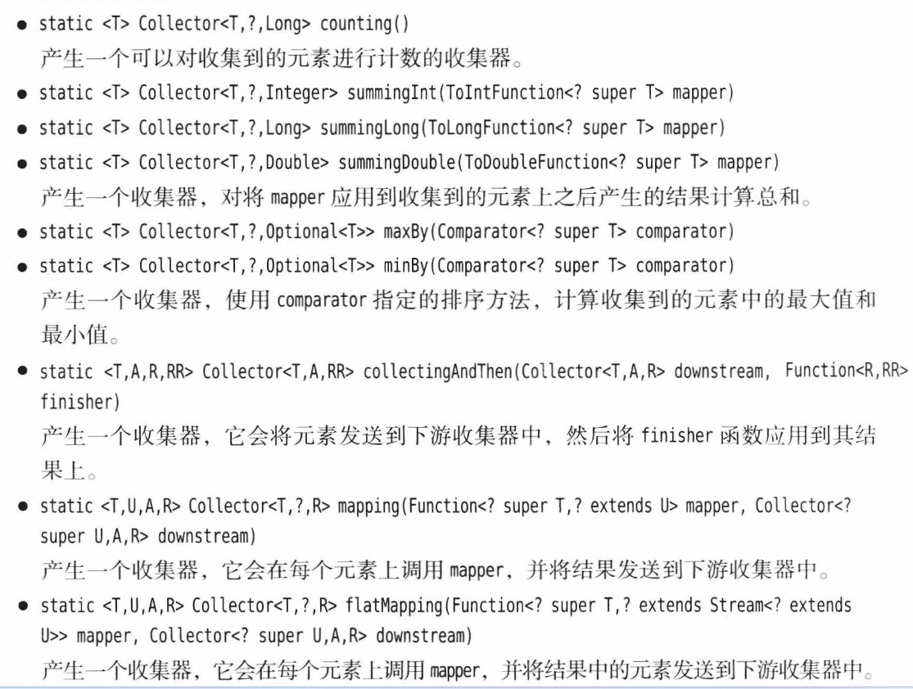

本小节主要讲解如何从流中收集结果, 例如收集到集合中或者映射. 另外还有一些分组收集方法以及约简规则, 约简是指将两个按照一个规则约简为一个元素, 通过不断地迭代, 最终流就被约简为一个最终结果.
## 流的终结 -- 收集结果
### 收集到集合
打印集合的一个优雅的方法, 先转为字符串流, 再 collect 到字符串并应用 Collectors.joining:
```java
public static <T> void show(String label, Collection<T> collect){
    System.out.print(label+"-"+collect.getClass().getSimpleName()+": ");
    String colStr = collect.stream().limit(10)
            .map(T::toString).collect(Collectors.joining(", "));
    System.out.println("["+colStr+"]");
}
```

Stream.iterate 方法, 一种按规则生成流的方式, 可以选择按迭代器风格遍历流, 另外收集到集合或数组时要规定构造函数以指明集合泛型类型:
```java
// 2. Stream.iterate 方法
public static void testIterate(){
    System.out.println("1. 生成一个非负偶数流, 限制 10 个");
    Iterator<Integer> iterator = Stream.iterate(0, n->n+2).limit(10).iterator();
    while (iterator.hasNext())
        System.out.print(iterator.next()+" ");
    System.out.println("\n");

    System.out.println("2. 从流中得到数组, 注意此时仍为Object[], 可以使用show打印它");
    Object[] objects = Stream.iterate(0, n->n+2).limit(10).toArray();
    show("objects", List.of(objects));
    System.out.println("2.1 从流中得到正确类型数组的错误和正确示范");
    System.out.println("---- ---- 不可以先获取再转型, 这对于数组是不可行的");
    try{
        Integer number = (Integer) objects[0];
        System.out.println("The 0th of integer is "+number);
        // but if cast an object[], it's not allowed
        Integer[] integerA = (Integer[]) objects;
        System.out.println(Arrays.toString(integerA));
    }catch (ClassCastException e){
        System.out.println(e);
    }
    System.out.println("---- ---- 但是可以传入 Integer[] 构造器");
    Integer[] integers = Stream.iterate(0, n->n+2).limit(10).toArray(Integer[]::new);
    System.out.println(Arrays.toString(integers));  // this is ok
    System.out.println("\n");
}
/*
1. 生成一个非负偶数流, 限制 10 个
0 2 4 6 8 10 12 14 16 18 

2. 从流中得到数组, 注意此时仍为Object[], 可以使用show打印它
objects-ListN: [0, 2, 4, 6, 8, 10, 12, 14, 16, 18]
2.1 从流中得到正确类型数组的错误和正确示范
---- ---- 不可以先获取再转型, 这对于数组是不可行的
The 0th of integer is 0
java.lang.ClassCastException: class [Ljava.lang.Object; cannot be cast to class [Ljava.lang.Integer; ([Ljava.lang.Object; and [Ljava.lang.Integer; are in module java.base of loader 'bootstrap')
---- ---- 但是可以传入 Integer[] 构造器
[0, 2, 4, 6, 8, 10, 12, 14, 16, 18]
*/
```
使用前一节的 wordList 生成一个只包含 含元音单词 的流(代码均在 OpCollectA.java 内):
```java
public static Stream<String> vowelStream(){
    return wordList.stream().filter(OpCollectA::hasVowel);
}
public static boolean hasVowel(String s){
    return s.contains("a") || s.contains("e") || s.contains("i") ||
            s.contains("o") || s.contains("u") || s.contains("A") ||
            s.contains("E") || s.contains("I") || s.contains("O") ||
            s.contains("U");
}
```
将它们收集到 HashSet 和 TreeSet 中, 注意这里每次都调用了一次生成流的函数, 因为流只能使用一次, 不可以像一般的对象暂存为一个对象然后多次使用:
```java
public static void testCollect(){
    System.out.println("3.1 collect to a normal HashSet");
    Set<String> stringSet = vowelStream().collect(Collectors.toSet());
    show("Collectors.toSet()", stringSet);
    System.out.println();

    System.out.println("3.2 collect to a TreeSet");
    TreeSet<String> stringTreeSet = vowelStream().collect(Collectors.toCollection(TreeSet::new));
    show("Collectors.toCollection(TreeSet::new)", stringTreeSet);
}
/*
3.1 collect to a normal HashSet
Collectors.toSet()-HashSet: [been, acutely, satisfactorily, overbearing, evidently, these, would, reproach, gloomy, rank]

3.2 collect to a TreeSet
Collectors.toCollection(TreeSet::new)-TreeSet: [A, As, Austen, Bennet, Bountiful, Burgh, But, Catherine, Collins, Darcy]
*/
```
又或者统计这些单词的长度, 并进行一些统计分析, 此外还 check 了 forEach 语法:
```java
public static void testIntStatistic(){
    System.out.println("4.1 统计包含元音的单词流中各个单词的长度");
    IntSummaryStatistics statistics = vowelStream().collect(Collectors.summarizingInt(String::length));
    System.out.println("average: " + statistics.getAverage());
    System.out.println("total number: " + statistics.getCount());
    System.out.println("max length: " + statistics.getMax());
    System.out.println();
    System.out.println("4.2 foEach 语法");
    vowelStream().limit(10).forEach(System.out::println);
}
/*
4.1 统计包含元音的单词流中各个单词的长度
average: 4.52073732718894
total number: 434
max length: 15
*/
```

### 收集到Map
假设我们有一个 `Stream<Person>`，并且想要将其元素收集到一个映射表中，这样后续就可以通过它们的ID来查找人员了。`collectors.toMap` 方法有两个函数引元，它们用来产生映射表的键和值. 如果有多个元素具有相同的键，就会存在冲突，收集器将会抛出一个ILLegalstateException异常。可以通过提供第3个函数引元来覆盖这种行为，该函数会针对给定的已有值和新值来解决冲突并确定键对应的值。这个函数应该返回已有值、新值或它们的组合。

先创建一个 Person 类, 它的id是私有自增的, 可以获取, 但不可设置:
```java
class Person{
    private static Integer cnt=1011;
    private final Integer id;
    String name;
    public Person(String name) {
        this.id = cnt++;
        this.name = name;
    }
    public Integer getId() { return id;}
    public String getName() { return name;}
    @Override
    public String toString() {
        return "Person{id=" + id + ", name='" + name + "'}";
    }
}
```
接着演示如何将 `Stream<Person>` 收集到 Map:
```java
// 1. 将 id 和 name 收集到 map
public static void testA(){
    Map<Integer, String> personMap = personStream()
    .collect(Collectors.toMap(Person::getId, Person::getName));
    System.out.println(personMap);
}
// 2. 将 id 和 对象本身 收集到 map
public static void testB(){
    Map<Integer, Person> personMap = personStream()
    .collect(Collectors.toMap(Person::getId, Function.identity()));
    System.out.println(personMap);
}
```
测试结果:
```java
/*
{1011=Peter, 1012=Julie, 1013=Mike, 1014=Lobby}
{1015=Person{id=1015, name='Peter'}, 1016=Person{id=1016, name='Julie'}, 1017=Person{id=1017, name='Mike'}, 1018=Person{id=1018, name='Lobby'}}
*/
```

接下来使用另一个例子 `Stream<Locale>` 说明 `Collectors.toMap()`第三个参数的用法, 它同样是一个函数.
我们想存储所有可用 locale 中的语言，其中每种语言在默认 locale 中的名字(例如"German")为键，而其本地化的名字(例如"Deutsch")为值, 一个合理的要求是 我们不关心同一种语言是否可能会出现两次(例如，德国和瑞士都使用德语)，因此我们只记录第一项。

这里还有一个例子作为练习:
现在，假设我们想要了解给定国家的所有语言，这样我们就需要一个`Map<String,Set<String>>`。例如，`"Switzerland"`的值是集`[French,German，Italian]`。首先，我们为每种语言都存储一个单例集。无论何时，只要找到了给定国家的新语言，我们就会对已有集和新集进行并操作。其次如果想要得到 TreeMap，那么可以将构造器作为第 4个引元来提供。你必须提供一种合并函数。
```java
public class ToMapHW {
    // 1. 获取展示语言名称和代号
    static void getLangSet(){
        Stream<Locale> localeStream = Stream.of(Locale.getAvailableLocales());
        Map<String, String> langNames = localeStream.collect(
                Collectors.toMap(Locale::getDisplayLanguage,
                        loc -> loc.getDisplayName(loc),
                        (existVal, newVal)-> existVal
                )
        );
        System.out.println(langNames);
    }
    // 2. 获取每个个国家使用的所有语言
    // [西班牙语, 切罗基语, 夏威夷语, 英语, 拉科塔语]
    static void getCountryLangSet(){
        Stream<Locale> localeStream = Stream.of(Locale.getAvailableLocales());
        Map<String, Set<String>> countryLanguageSet = localeStream.collect(
                Collectors.toMap(
                        Locale::getDisplayCountry,
                        loc -> Collections.singleton(loc.getDisplayLanguage()),
                        (a, b)->{
                            Set<String> union = new HashSet<>(a);
                            union.addAll(b);
                            return union;
                        },
                        TreeMap::new
                )
        );
        System.out.println(countryLanguageSet.get("美国"));
    }
}
```
### 分组收集
```java
static <T,K> Collector<T,?,Map<k,List<T>>> groupingBy(Function<? super T,? extends K>classifier)
static <T,K> Collector<T,?,ConcurrentMap<K,List<T>>> groupingByConcurrent(Function<? superT,? extends K> classifier)
```
产生一个收集器，它会产生一个映射表或并发映射表，其键是将 classifier 应用于所有收集到的元素上所产生的结果，而值是由具有相同键的元素构成的一个个列表。

`groupingBy` 方法会产生一个映射表，它的每个值都是一个列表。如果想要以某种方式来处理这些列表，就需要提供一个“**下游收集器**”。例如，如果想要获得集而不是列表，那么可以使用上一节中看到的 `Collectors.toSet` 收集器
`Map<String，Set<Locale>> countryToLocaleSet = locales.collect(groupingBy(Locale::getCountry，toSet()));`

将收集器组合起来是一种很强大的方式，但是它也可能会导致产生非常复杂的表达式最佳用法是与 groupingBy 和 partitioningBy 一起处理“下游的”映射表中的值。否则，应该直接在流上应用诸如 map、reduce、count、max或min 这样的方法


### 基本类型流
```java
public class PrimitiveTypeStreams {
    // 1. show the int stream
    public static void show(String label, IntStream stream){
        final int SIZE = 10;
        int[] integers = stream.limit(SIZE).toArray();
        System.out.println(label);
        System.out.print("\t");
        for(int i=0; i<integers.length; i++){
            System.out.print(integers[i]);
            if(i<integers.length-1) System.out.print(", ");
            else System.out.println(" ...");
        }
        System.out.println();
    }

    public static void main(String[] args) {
        IntStream stream = IntStream.generate(()->(int)(Math.random()*100));
        show("1. use generate() to get random int stream", stream);
        IntStream stream1 = IntStream.range(2, 10);
        show("2. range(2, 10)", stream1);
        IntStream stream2 = IntStream.rangeClosed(2, 10);
        show("3. rangeClosed(2, 100)", stream2);
        // 4. here we use wordStream() to get a string stream
        show("4. use mapToInt like the len(str)", wordStream().mapToInt(String::length));
        // 5. CharSequence 接口拥有 codePoints 和 chars 方法
        //    可以生成由字符的 Unicode 码或由 UTF-16编码机制的码元构成的IntStream
        String sentence = "5. \uD835\uDD46 is the set of oct onions.";
        System.out.println(sentence);
        IntStream stream3 = sentence.codePoints();
        System.out.println(stream3.mapToObj(s->String.format("%x", s)).collect(Collectors.joining(" ")));
        System.out.println();
        // 6. 可使用 Boxed() 将 IntStream 转为 Integer
        Stream<Integer> stream4 = IntStream.range(2, 100).boxed();
        show("6. `Stream<Integer>` <-> `IntStream`", stream4.mapToInt(Integer::intValue));
    }
}
```
### 并行流
...

